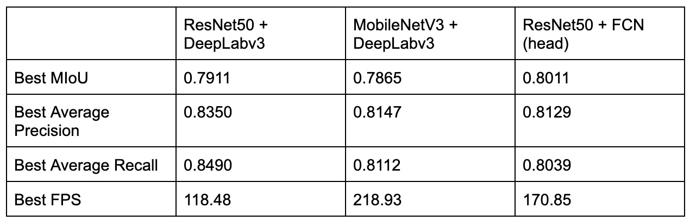
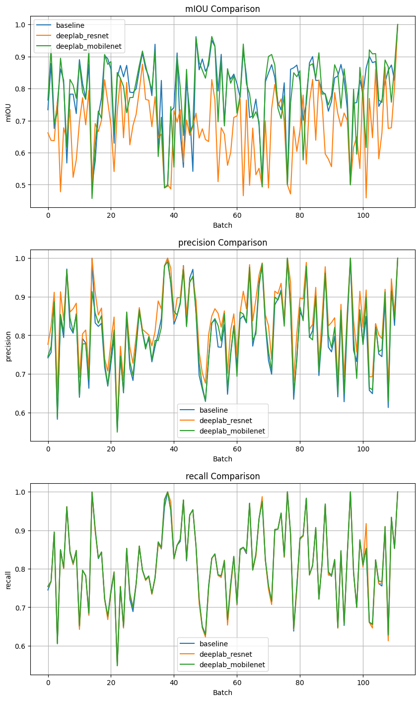

# Results and Implications

---

## Evaluation on Speed

In the table above, we analyze the impact of different model structures on inference speed. The results indicated that either adopting a lightweight backbone or a simpler head can lead to significant improvement in inference speed. We present 2 key insights: 1) Model complexity is crucial for our task of real-time garbage segmentation; 2) In general, changing the backbone into a lighter one generally can lead to a larger bump than changing the head, as the majority of the inference time is usually taken by the backbone.

Our explanation is that the backbone is responsible for extracting hierarchical features from the input image. These operations, due to their depth and complexity, can consume a significant portion of the computational resources during inference. As such, opting for a more efficient backbone, such as MobileNetV3 [6] instead of ResNet50 [5], can often lead to a noticeable improvement in inference speed. The head of the model, on the other hand, typically performs some task-specific transformations on the features extracted by the backbone. In the case of semantic segmentation, this might include a series of convolutions and upsampling operations to generate a pixel-wise classification of the input image. While these operations can also be computationally expensive, they usually don't contribute as much to the overall computational cost as the backbone.

## Evaluation on Accuracy

The table and figure above show the performance of the different models on the test data. While the combination of ResNet50 and DeepLabv3 achieves the highest accuracy, it falls short in MIoU metric. We propose 2 explanations for such discrepancy: 1) High classification ability does not guarantee a comparably good segmentation ability. For instance, ResNet50 is a deeper and more complex model than MobileNetV3, which enables it to learn more complex features. This can potentially lead to higher classification accuracy but not necessarily better semantic segmentation performance, since semantic segmentation depends greatly on pixel-level information, not just object-specific features. It needs to identify boundaries and the extent of objects, which requires understanding the context of surrounding pixels as well; 2) Overfitting: models that learn more complex features often have a higher capacity (more parameters), which increases the risk of overfitting. In this case, the model backed by ResNet50 would be too attuned to the training data for semantic segmentation and did not generalize well to unseen data. It might have picked up on very specific patterns in the training data that do not hold in the validation or test set. By contrast, the combination of MobileNetV3 and DeepLabv3 achieved outstanding results in all 3 accuracy metrics: MIoU, precision, and recall. MobileNetV3 is designed to be computationally efficient and is particularly suitable for mobile devices. Despite its reduced complexity, when combined with the powerful segmentation capabilities of DeepLabv3, it performs well on this segmentation task, achieving a desirable trade-off between performance and computational cost.

## Final Implication

Based on our experiment results and analysis, we can see that the combination of MobileNetV3 and DeepLabv3 reveals the strongest deployment applicability, with the highest FPS, solid MIoU, precision, and recall performance.
